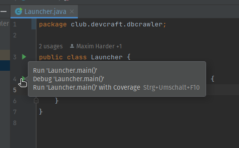
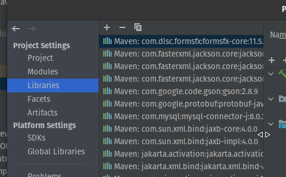
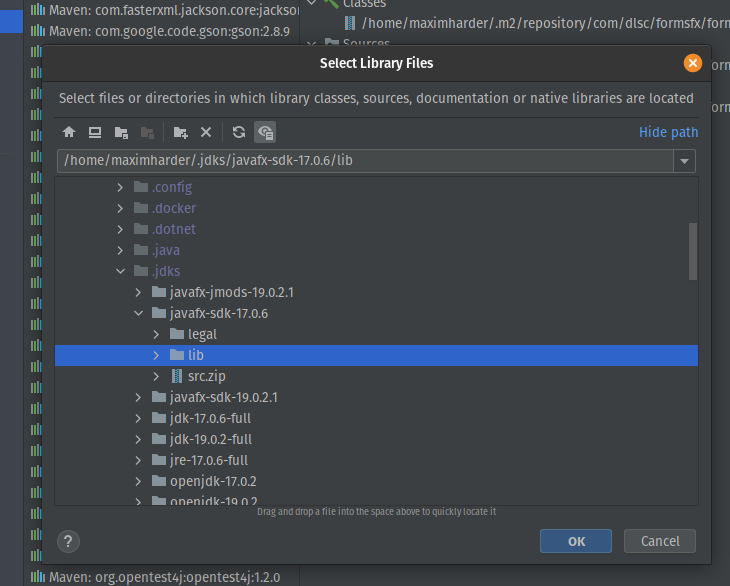
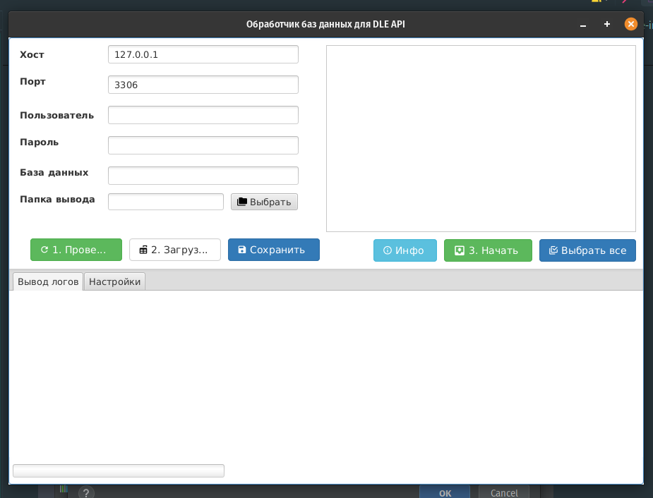

# DbCrawler

Программа, что позволяет создать файлы для Routing для [DLE-API](https://github.com/Gokujo/dle-api). Написано всё на Java/JavaFX и планировалось экспортировать её для всех платформ, однако в стандартных библиотеках отсутствует fx:deploy и танцы с бубном мне надоели. Поэтому публикую так, как есть. Если кто-то сможет экспортировать в программы, буду ему признателен.

---

**Минимальная версия Java**: 17 (Рекоммендую брать полную версию от [BellSoft](https://bell-sw.com/pages/downloads/))

**Доп. библиотека**: [JavaFX](https://gluonhq.com/products/javafx/) (При условии, что используется стоковая Java 17), остальное прописано в pom.xml и устанавливается автоматически

---

Рекомендую использовать JetBrains Intellij. Даже Community версия сойдёт. Импортируем проект и переходим к файлу src->main->java->club.devcraft.dbcrawler->Launcher.java. Запускаем



Если видим ошибку

```java:
java: module not found: org.controlsfx.controls
```

То нужно подключить библиотеку JavaFX. Заходим в File->Project Structure. В меню **Project Settings** выбираем пункт **Libraries**.



Нажимаем **+** и выбираем путь до библиотеки JavaFX



И при запуске получим такое окно



Заполняем поля и настраиваем программу во вкладке "**Настройки**".

Следуем нумерованию на кнопках.


В итоге должны получить файлы с рутингом
